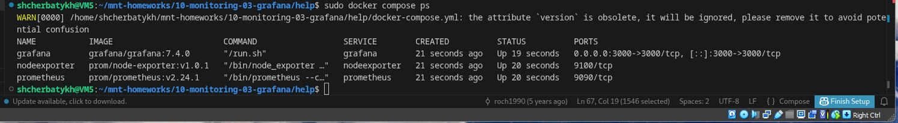
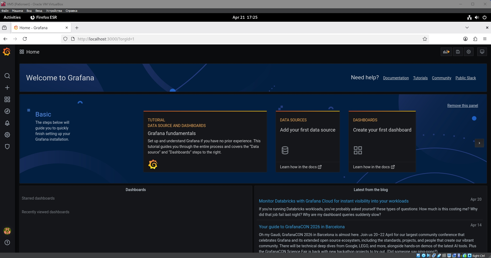
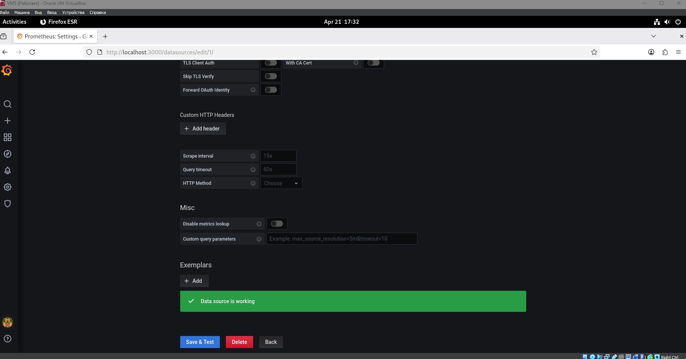
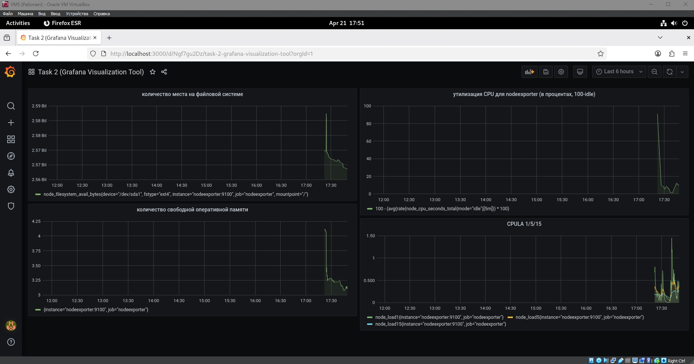
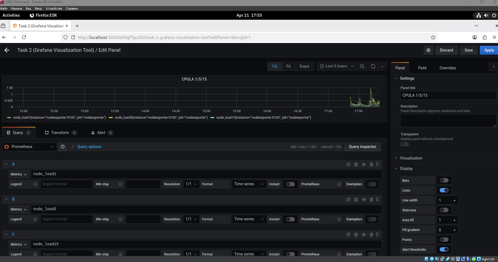
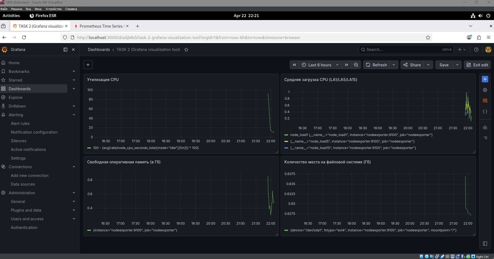

## Домашнее задание к занятию 14 «Средство визуализации Grafana» FOPS-38 (Щербатых А.Е.)

### Обязательные задания

### Задание 1

1. Используя директорию [help](https://github.com/netology-code/mnt-homeworks/tree/MNT-video/10-monitoring-03-grafana/help) внутри этого домашнего задания, запустите связку prometheus-grafana.
2. Зайдите в веб-интерфейс grafana, используя авторизационные данные, указанные в манифесте docker-compose.
3. Подключите поднятый вами prometheus, как источник данных.
4. Решение домашнего задания — скриншот веб-интерфейса grafana со списком подключенных Datasource.

### Выполнение

1. Запускаем связку prometheus-grafana



2.  Заходим в веб-интерфейс grafana



3.  Подключаем prometheus как источник данных



---

### Задание 2

Создайте Dashboard и в ней создайте Panels:

- утилизация CPU для nodeexporter (в процентах, 100-idle);
- CPULA 1/5/15;
- количество свободной оперативной памяти;
- количество места на файловой системе.
  
Для решения этого задания приведите promql-запросы для выдачи этих метрик, а также скриншот получившейся Dashboard.

### Выполнение

Создал Dashboard и в ней панели с указанными выше по тексту метриками.



Promql-запросы, использованные при создании панелей:

- утилизация CPU для nodeexporter (в процентах, 100-idle); ```100 - (avg(rate(node_cpu_seconds_total{mode="idle"}[5m])) * 100)```
- CPULA 1/5/15; ```node_load1 node_load5 node_load15``` в каждой отдельной строке запроса


  
- количество свободной оперативной памяти; ```node_memory_MemFree_bytes / 1024 / 1024 / 1024```
- количество места на файловой системе. ```node_filesystem_avail_bytes{mountpoint="/", fstype!~"tmpfs|overlay"} / 1024 / 1024 / 1024```

  ---

### Задание 3

Создайте для каждой Dashboard подходящее правило alert — можно обратиться к первой лекции в блоке «Мониторинг».
В качестве решения задания приведите скриншот вашей итоговой Dashboard.

### Выполнение

Т.к. в предоставленной сборки контейнер с Grafana содержал версию 7.4.0, в которой у меня не получилось создать правило alert, рискнул заменить версию Grafana на самую свежую (13.0.1). Из-за конфликта базы данных SQLite старой версии с новой структурой пришлось удалить том данных Grafana и запустить чистую версию. Для корректности выполнения задания пересобрал Dashboard с панелями заново. 

Получилось вот так



Затем создал правило alert для панели "Количество места на файловой системе" т.к. по этой метрике уже получил alert со статусом Firing (для наглядности).

Получилась вот такая картина (сломаное сердечко умилило прям)


### Задание 4

Сохраните ваш Dashboard.Для этого перейдите в настройки Dashboard, выберите в боковом меню «JSON MODEL». Далее скопируйте отображаемое json-содержимое в отдельный файл и сохраните его.
В качестве решения задания приведите листинг этого файла.

