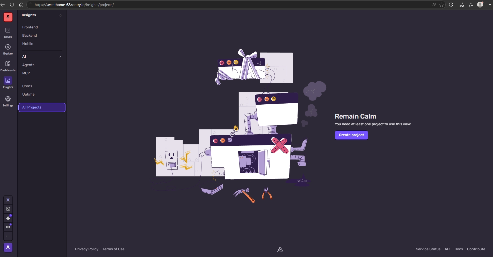
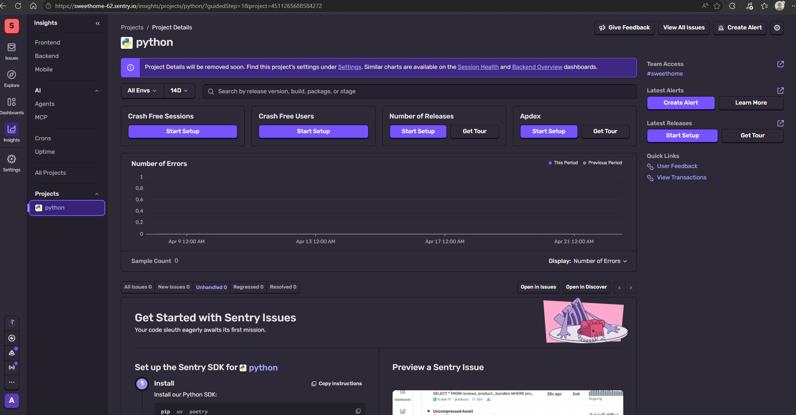
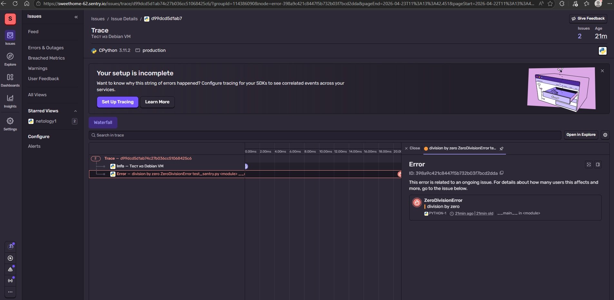

## Домашнее задание к занятию 16 «Платформа мониторинга Sentry» FOPS-38 (Щербатых А.Е.)

### Задание 1

Так как Self-Hosted Sentry довольно требовательная к ресурсам система, мы будем использовать Free Сloud account.

Free Cloud account имеет ограничения:

5 000 errors;
10 000 transactions;
1 GB attachments.
Для подключения Free Cloud account:

- зайдите на sentry.io;
- нажмите «Try for free»;
- используйте авторизацию через ваш GitHub-аккаунт;
- далее следуйте инструкциям.

В качестве решения задания пришлите скриншот меню Projects.

### Выполнение

---

### Задание 2
Создайте python-проект и нажмите Generate sample event для генерации тестового события.

Изучите информацию, представленную в событии.

Перейдите в список событий проекта, выберите созданное вами и нажмите Resolved.

В качестве решения задание предоставьте скриншот Stack trace из этого события и список событий проекта после нажатия Resolved.

### Выполнение

---
