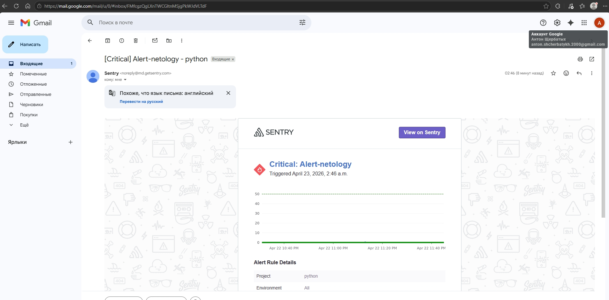
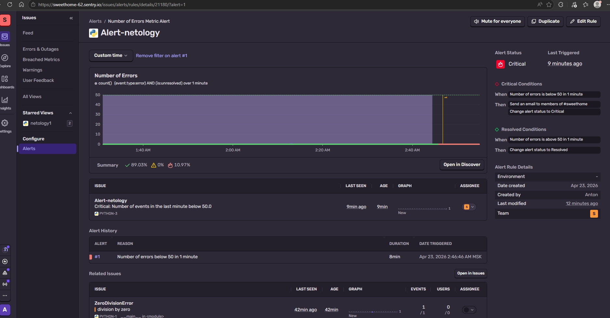

## Домашнее задание к занятию 16 «Платформа мониторинга Sentry» FOPS-38 (Щербатых А.Е.)

### Задание 1

Так как Self-Hosted Sentry довольно требовательная к ресурсам система, мы будем использовать Free Сloud account.

Free Cloud account имеет ограничения:

5 000 errors;
10 000 transactions;
1 GB attachments.
Для подключения Free Cloud account:

- зайдите на sentry.io;
- нажмите «Try for free»;
- используйте авторизацию через ваш GitHub-аккаунт;
- далее следуйте инструкциям.

В качестве решения задания пришлите скриншот меню Projects.

### Выполнение

---

### Задание 2
Создайте python-проект и нажмите Generate sample event для генерации тестового события.

Изучите информацию, представленную в событии.

Перейдите в список событий проекта, выберите созданное вами и нажмите Resolved.

В качестве решения задание предоставьте скриншот Stack trace из этого события и список событий проекта после нажатия Resolved.

### Выполнение

---

### Задание 3
Перейдите в создание правил алёртинга.

Выберите проект и создайте дефолтное правило алёртинга без настройки полей.

Снова сгенерируйте событие Generate sample event. Если всё было выполнено правильно — через некоторое время вам на почту, привязанную к GitHub-аккаунту, придёт оповещение о произошедшем событии.

Если сообщение не пришло — проверьте настройки аккаунта Sentry (например, привязанную почту), что у вас не было sample issue до того, как вы его сгенерировали, и то, что правило алёртинга выставлено по дефолту (во всех полях all). Также проверьте проект, в котором вы создаёте событие — возможно алёрт привязан к другому.

В качестве решения задания пришлите скриншот тела сообщения из оповещения на почте.

Дополнительно поэкспериментируйте с правилами алёртинга. Выбирайте разные условия отправки и создавайте sample events

### Выполнение

---

Посмотрел несколько дополнительных видео на YouTube, но за три часа сильно вникнутьв систему, которую впервые увидел при прохождении данного курса - непросто (во всяком случае мне). Попробовал соотнести полученные из видеолекции и видео на YouTube с тем, что написано в тексте ДЗ (ему, кстати, несколько лет, а интерфейс ПО изменился уже).
Надеюсь, всё выполнил правильно.
